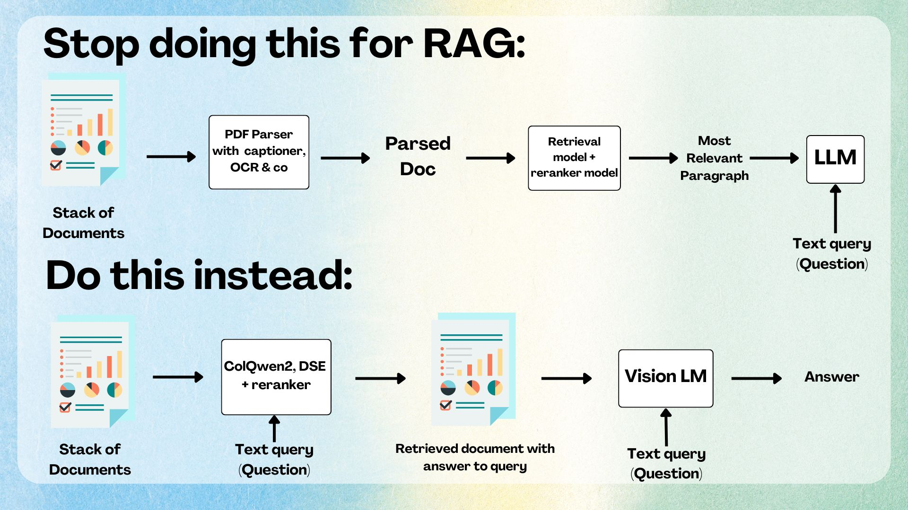

# GraphRAG using Neo4j graph database

## Overview
This repository is part of Google's 5-Day Intensive GenAI Course. It implements a Hybrid GraphRAG Agent using Gemini as the LLM orchestration layer, combining the power of Retrieval Augmented Generation with graph-based knowledge representation.

## Project Purpose
The AI Agent is designed to be grounded in documentation from:
- [Visual Molecular Dynamics (VMD)](https://www.ks.uiuc.edu/Research/vmd/) - A molecular visualization program for displaying, animating, and analyzing large biomolecular systems.
- [Nanoscale Molecular Dynamics (NAMD)](https://www.ks.uiuc.edu/Research/namd/) - A parallel molecular dynamics code designed for high-performance simulation of large biomolecular systems.
- [BioPython](https://biopython.org/) - A set of tools for biological computation.
- Google Search - Real-time information retrieval for latest molecular dynamics research and techniques.

By integrating these resources into a graph database, the system aims to provide intelligent responses to complex queries about molecular dynamics simulations and protein visualization.

## Features

- PDF document ingestion and processing using `PyMuPDF` (originally tried `Marker-PDF`, but took too long).
- Knowledge graph representation in Neo4j
- RAG-enhanced responses using Gemini LLMs
- Interactive query interface via Streamlit (or Gradio)
- Multi-agent workflow for specialized tasks and comprehensive responses

## Multiagent Workflow

The system implements a specialized multiagent architecture where different agents handle specific tasks:

[](https://mermaid.live/edit#pako:eNqFVFmP2jAQ_iuWpX1pA4JACGuplTgk-kLFUfHQpg9uMoC1YFPjoFLEf18fm4OEXfLgzMw3nvOTLzgWCWCCj4oqGDO6kXTfOPkRjzjS30IIReyJBhvgylnHIl6AkgxOdEfQt_MfyRK0gng8RJ_RRNLDFi0GE-c7EvwE8kgVE5zu2FGHq5nKsUe6nhVItmYgidVQpjqH2Xi4BCrjLTEimkmhGHDkbBF_ekKNyufuzX9Iyo8EzVOQZ2SVnS2hnH2a7hSbE_dvWFcHLBUchjR-IVZqGPGDXEMmZme1FZwUokNW0zExh9O-D4xqzrdxw1EnJmbAWtYlvpiu300zAa6dlNCDysW3KUqm2N8USC6ZjepAXypftuhfn37rJF_tqovVW1NtXTW82FgFyndVsbtdZLmdZoEys-pcq1RY55HBdScfjMzyPMt4cbZy_44AdXu2_wJxnkXK6o0bY3a9hDjw-rDWmwHcqbhCsDKU86xsLNh2w1Q3W8u_AtUB7tpNjLuA02_7f9xifZF3-qww_Ib_joc50zM8s7x3_wZ_WC_28B7knrJEv5e2wAirLewhwkSLCaypmQWO-FW70lSJ5ZnHmCiZgoelSDdbTNZ0d9RaekiK9zZzgYTp8qbuQbbvsocPlP8UInfRKiYX_A-TdtBpBr2g4_e77cAPu72-h8-YdPxm_9kPWt1--Oz3_SAIrh7-byO0mmHYaXVD32-1O70w7OsbEngCciRSrjDxg17PwxtpGjTprq-X6MYZ)

### Agent Responsibilities

- **Root Agent**: Orchestrates the workflow, handles document retrieval, verifies code, searches PDB for protein information, and manages conversation flow.
- **Doc Retrieval Agent**: Retrieves relevant documentation from specialized sources:
  - BioPython Documentation
  - VMD (Visual Molecular Dynamics) Documentation
  - NAMD (Nanoscale Molecular Dynamics) Documentation
- **Conversationalist Agent**: Manages the response generation process with:
  - Generator: Creates initial responses based on retrieved information
  - Critique: Reviews and improves responses for accuracy and completeness

This multiagent architecture enables specialized handling of complex molecular dynamics queries while maintaining high-quality, informative responses.

## Getting Started

0. You will need `docker`, `docker-compose`, ...
1. Setup your secrets. For [more details ...](./dot-secrets/readme.md)
2. Setup Neo4j database. For [more details ...](./Neo4j/readme.md).

## Project Structure

- `/data/pdfs/` - Source documentation in PDF format
- `/data/neo4j_db/` - The Neo4j graph database
- `/src/` - Source code for the GraphRAG implementation

## Next Steps

- [ ] Compare and Implement [`Docling`](https://github.com/docling-project/docling) instead of `PyMuPDF` for PDF ingestion
- [ ] Try the [Visual Document Retrieval](https://huggingface.co/docs/transformers/main/en/tasks/visual_document_retrieval#visual-document-retrieval) instead of a simple RAG, while indexing and retrieving the documents with [ColPali](https://huggingface.co/docs/transformers/main/en/model_doc/colpali).

 

## License

This project is licensed under the Apache License 2.0 - see the [LICENSE](LICENSE) file for details.
